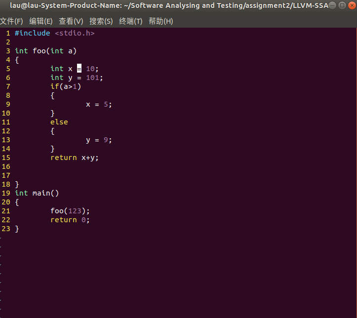
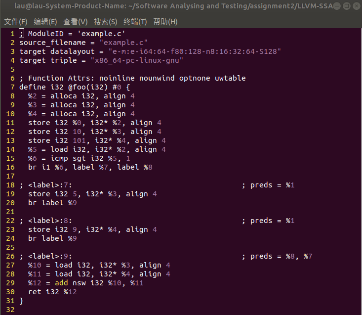

# LLVM-SSA
software analysis and test assignment 2 

DZ1933019 刘旭同
源代码如下:

使用llvm抽取的中间表示如下:

第12行给变量%3赋值为10,第19行给变量 **3%** 赋值为5,同一个内存地址被赋值两次,说明该程序未能被完全转化为SSA.
另外第13行和第23行也累计对变量 **4%** 赋值两次,此处也未能做到一个内存地址只被赋值一次.
